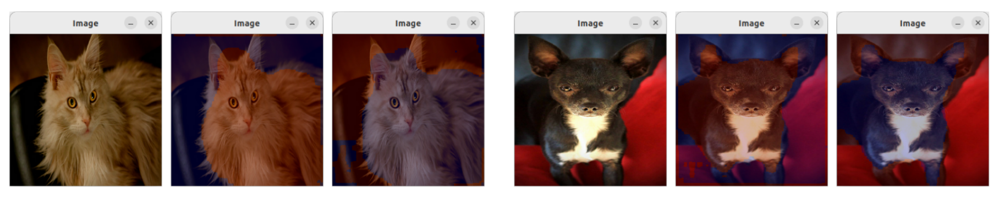
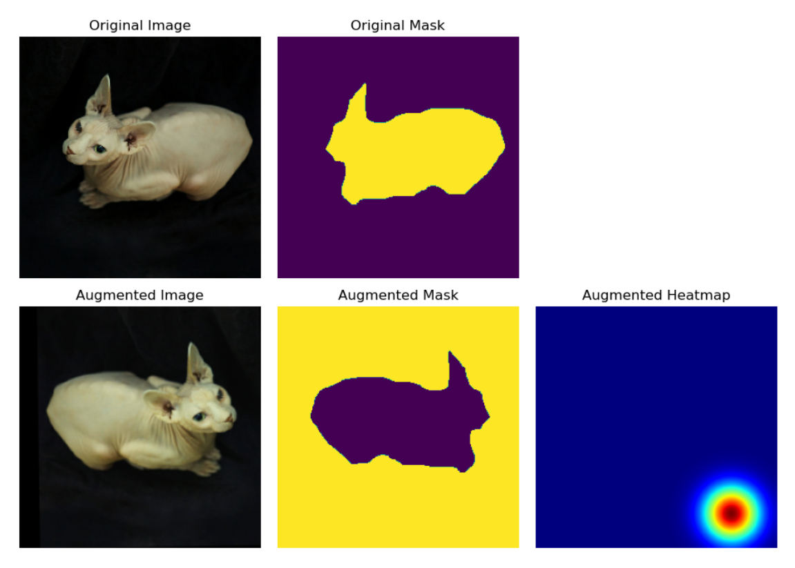
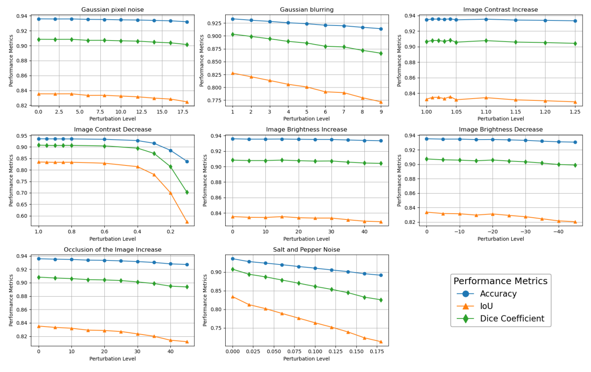

# Oxford-IIIT Pet Image Segmentation


A comparative study of deep learning architectures for semantic image segmentation on the Oxford-IIIT Pet Dataset. This project implements U-Net, Autoencoders, and CLIP-based models, featuring an interactive prompt-based segmentation tool.

<p align="center">
  
  <br>
  <em>Figure 1: Interactive segmentation workflow. (1) Input image, (2) User selects animal (red), (3) User selects background (blue).</em>
</p>

## 🚀 Features
- **Architectures**: Custom U-Net, Autoencoder Pre-training, Hybrid CLIP-ViT Decoder.
- **Robustness**: Extensive testing against noise, blur, and geometric perturbations.
- **Interactivity**: Prompt-based segmentation using text or point clicks.
- **Metrics**: Intersection over Union (IoU) and Dice Coefficient tracking.

## 🧠 Methodology: Prompt-Based Segmentation
Unlike standard segmentation, this project implements a **Prompt-CLIP model** that accepts user clicks.

1. **Gaussian Heatmap**: A user click is converted into a Gaussian heatmap.
2. **Feature Fusion**: The heatmap is encoded and concatenated with CLIP-ViT visual features.
3. **Prediction**: The decoder generates a binary mask based on the specific region of interest.

<p align="center">
  
</p>

## 📊 Results & Robustness

We evaluated four models: U-Net, Autoencoder, CLIP-based, and Prompt-CLIP. The CLIP-based architecture demonstrated superior performance, particularly when combining Colour and Geometric augmentations.

| Model | Augmentation | IoU | Dice Score |
|-------|--------------|-----|------------|
| U-Net (Baseline) | None | 0.56 | 0.68 |
| U-Net | Colour + Geometric | 0.53 | 0.83 |
| **CLIP-Based** | **Colour + Geometric** | **0.85** | **0.92** |

### Robustness Analysis
The model was stressed against 8 incremental perturbations (noise, blur, contrast). As shown below, the CLIP model (Blue line) maintains high accuracy even under significant distortion, only failing under extreme contrast reduction.

<p align="center">
  
</p>

## 📂 Project Structure
```bash
├── models/           # Pre-trained checkpoints (ignored in git)
├── notebooks/        # Experiments and Training logs
│   ├── 01_unet.ipynb
│   ├── 02_clip_model.ipynb
│   └── ...
├── src/              # Source code modules
│   ├── augmentation.py
│   ├── modeling.py
│   └── ...
├── Computer_Vision_Report.txt
└── requirements.txt
```

## 🛠️ Installation

1. **Clone the repository**
   ```bash
   git clone https://github.com/yourusername/oxford-pet-segmentation.git
   cd oxford-pet-segmentation
   ```

2. **Install dependencies**
   ```bash
   pip install -r requirements.txt
   ```

3. **Data Setup**
   The project uses `tensorflow_datasets`. The dataset will download automatically upon first run.

## 💻 Usage

To train the U-Net model from scratch:
Open `notebooks/01_unet_training.ipynb` and run all cells.

To evaluate model robustness:
Run `notebooks/04_robustness_analysis.ipynb`.
